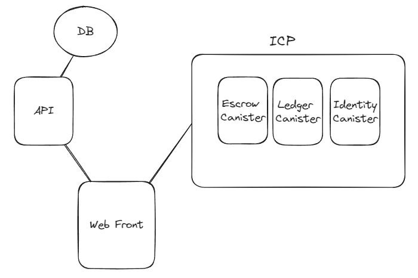
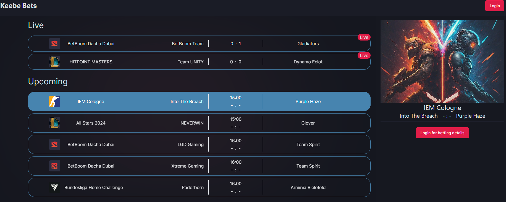
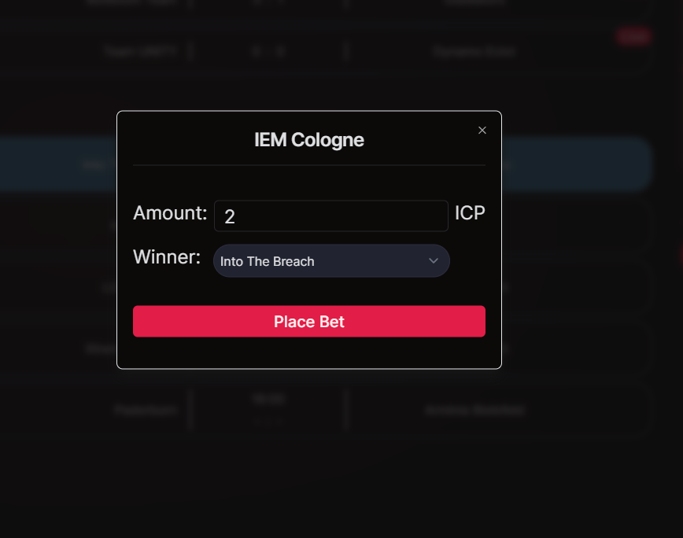
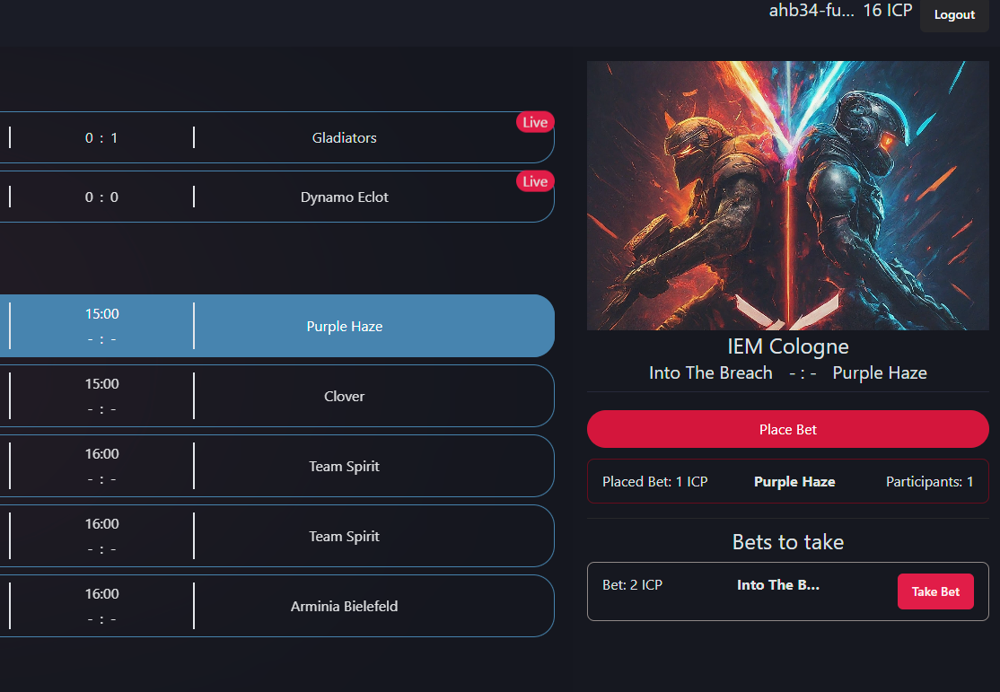
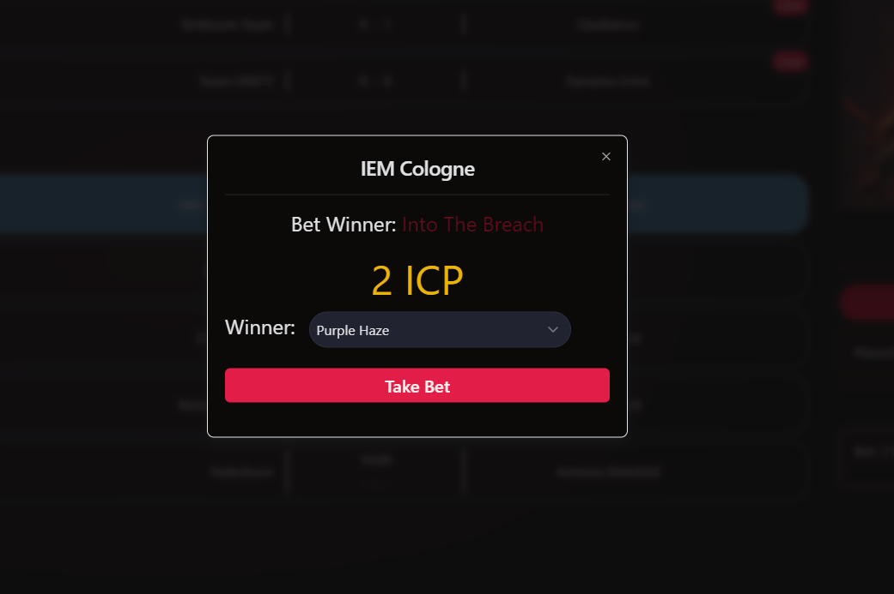

# Keebe Bets

[This Project is still in development]

## Introduction

This project is a small betting platform PoC built with SvelteKit, SQLite, and the Internet Computer Protocol (ICP) with canisters written in Rust. It uses ICP tokens as a value of exchange for bets. The user can place bets for upcoming matches and take bets from different events. The authentication is made using the ICP identity canister, and the escrow canister act as a bookmaker.

## System Architecture

The system is composed of:

- A web frontend built with SvelteKit
- An API built-in with SvelteKit
- A SQLite database
- Connection to the ICP network with 3 canisters



## Canisters

The system uses three canisters:

1. **Escrow**: This canister acts as a bookmaker. It handles the placement of bets and the distribution of prize bets after an event ends.
2. **Ledger**: This canister is installed and handles the transactions.
3. **Identity**: This canister is installed and handles user authentication.

## User Flow

1. The user logs in using their ICP identity.
   
   
2. The user places a bet using the escrow canister.
   
   
3. The user can take other bets from other users.
   
4. The escrow canister settles and distributes prize bets after the event ends using HTTP out calls.

## Setup

### Prerequites

- Rust (https://rustup.rs)
- IC SDK (https://internetcomputer.org/docs/current/developer-docs/getting-started/install/)

### Steps

- Start dfx local env

```
dfx start
```

- Install the ledger canister using the install script

```
./canitesters/src/ledger/install.sh
```

- Install the identity canister

```
cd canisters && dfx deploy identity
```

- Install the escrow canister and generate definitions and models

```
make deploy
```

- Configure environment variables
